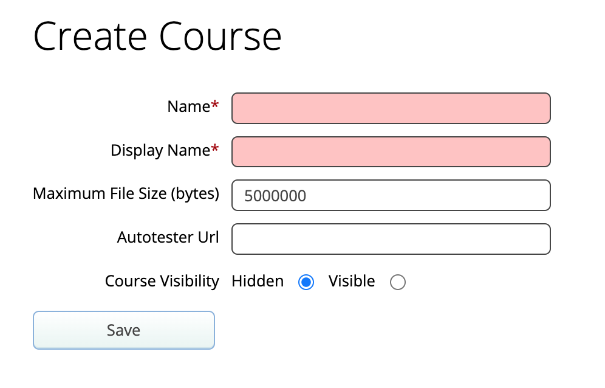

# Admin Guide

## Table of Contents

- [Navigating to the Administration Page](#navigating-to-the-administration-page)
- [Managing Courses](#managing-courses)

## Navigating to the Administration Page

After logging in to MarkUs as an Admin, you will be directed to the MarkUs Administration home page.

If you navigate away from the Administration Page and wish to return, click on the "Administration" tab found in the header.

**Note**: Ensure that you are viewing MarkUs as an admin and have not switched roles. Otherwise, you will be unable to access the "Administration" tab.

## Managing Courses

To manage courses, navigate to the "Courses" sub tab on the MarkUs Administration Page.

This will take you to a page that lists all the courses of this particular MarkUs instance. From this page, you can view and manage information about each course.

### Creating and editing a course

In order to create a course, click on the "Create Course" link located at the top right corner of the page.

This will redirect you to a page where you can specify the following course properties:

- **Name**: The name or course code for this course
- **Display Name**: A longer course name or title for users to see
- **Course Visibility**: Selecting "hidden" will hide the course from students in a course. Graders and instructors for the course can still see and manage the course as usual.

After clicking "Save", the course will be created and you will be taken back to the list of all courses.

If you later wish to modify any properties of a course you can reach any course's edit page by going to the list of all courses and clicking on the "edit" action of the course you wish to modify.

From the edit page of a course you can modify the same properties specified when creating the course.

## Managing Users

As with courses, to manage users, navigate to the "Users" sub tab on the MarkUs Administration Page.

This will take you to a page that lists data about every admin and end user.

### Creating and Editing Users

In order to create a user, click on the "Create User" link located at the top right corner of the page.

This will redirect you to a page where you can specify the following user information:

- **User Name**: The username alias for this user.
- **First Name**: This user's first name.
- **Last Name**: This user's last name.
- **ID Number**: This user's id number. This can be blank if it is not applicable to a user.
- **Email**: This user's email address. This can be blank if it is not applicable to a user.
- **Type**: A user can either be an "Admin User" or an "End User". In most cases, you will likely want to create an "End User". "End Users" are regular users who can later be specified as an "Instructor", "TA", or "Student" for a particular course. "Admin Users" have the ability to manage MarkUs and view all courses as if they were instructors. Be sure to only give an Admin User account to trusted users.

After clicking "Save", the user will be created and you will be taken back to the list of all users.

If you later wish to modify any properties of a user you can reach a user's edit page by navigating to the list of all users on the MarkUs Administration Page and clicking on the "edit" action of the user you wish to modify.

From the edit page of a user you can modify the same properties specified when creating a user.

