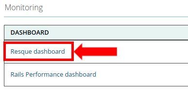
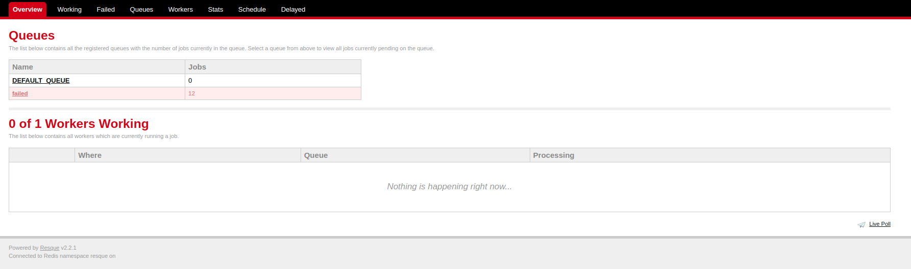
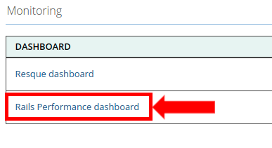
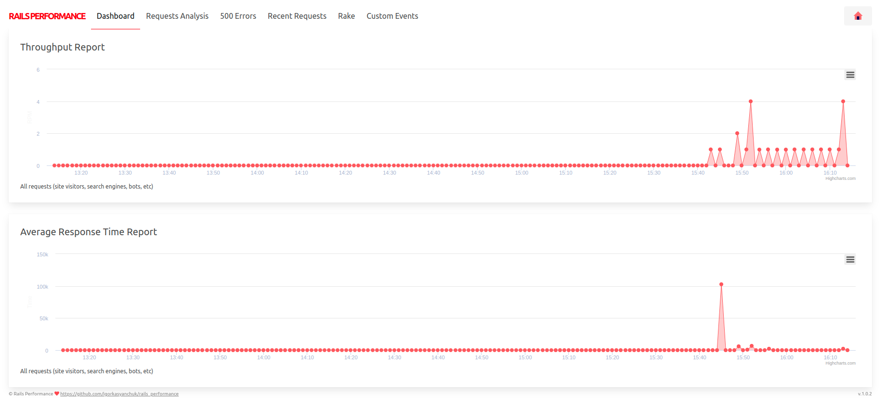
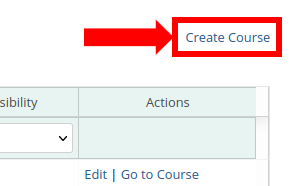
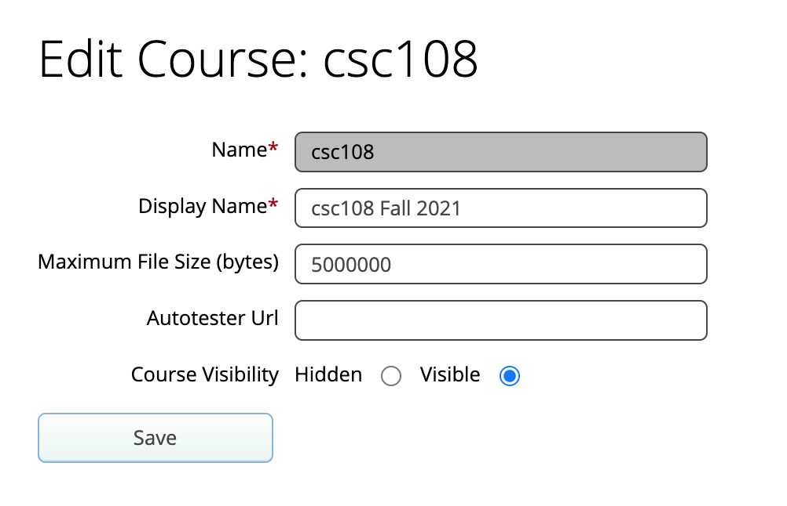
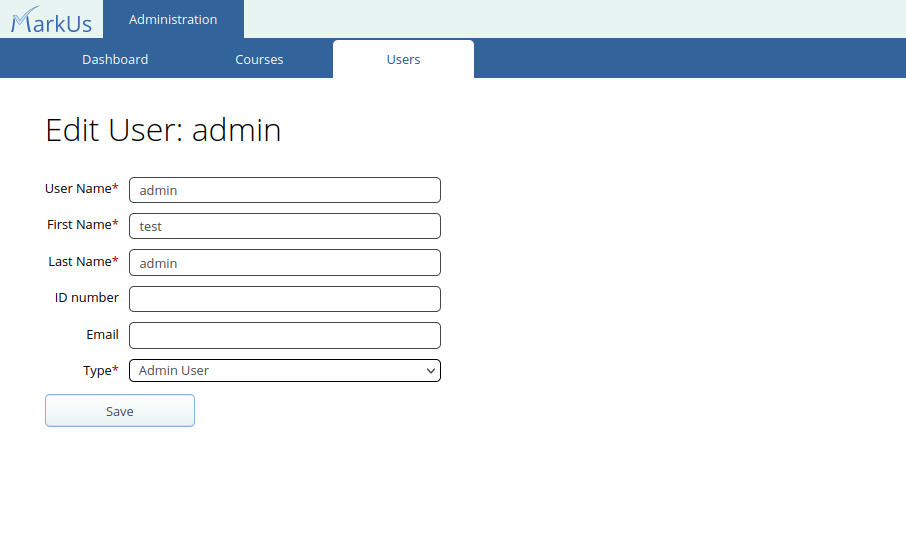

# Admin Guide

## Table of Contents

- [Navigating to the Administration Page](#navigating-to-the-administration-page)
- [Monitoring Dashboards](#monitoring-dashboards)
- [Managing Courses](#managing-courses)
- [Managing Users](#managing-users)

## Navigating to the Administration Page

After logging in to MarkUs as an Admin, you will be directed to the MarkUs Administration home page.


If you navigate away from the Administration Page and wish to return, click on the "Administration" tab found in the header.


**Note**: Ensure that you are viewing MarkUs as an admin and have not switched roles. Otherwise, you will be unable to access the "Administration" tab.

## Monitoring Dashboards

From the MarkUs Administration home page, you can view a list of dashboards. These dashboards are provided using third party ruby gems that allow for quick and easy monitoring of what is happening in MarkUs.

### Resque

The Resque dashboard allows you to easily monitor monitor queues, jobs, and workers for MarkUs' background jobs. To access this dashboard click on the `Resque dashboard` link.





This tool allows you to monitor the status of each worker, display information about any delayed/failed jobs, monitor queues and view configurations for Resque. This dashboard is included from the Resque gem. For more information about this tool, please see the Resque [homepage](https://github.com/resque/resque#the-front-end).

### Rails Performance

The Rails Performance dashboard allows you to monitor and visualize information regarding request traffic and MarkUs' response times. To enable this dashboard, in the MarkUs [settings yaml file](Configuration.md#markus-settings) ensure you set the `enabled` setting under `rails_performance` to true. Once you have confirmed the MarkUs server was started with this setting enabled, log in to the MarkUs Administration home page. You will see a link to the `Rails Performance dashboard`.





This tool allows you to monitor and visualize information surrounding each request that is made to MarkUs. You can view the time it took for MarkUs to respond to each request, how many requests per minute MarkUs recieves, any 500 errors that occurred and the most common requests MarkUs recieves. This dashboard is currently supported through the `rails_performance` gem. For more information about what you can access see the Rails Performance [homepage](https://github.com/igorkasyanchuk/rails_performance).

## Managing Courses

To manage courses, navigate to the "Courses" sub tab on the MarkUs Administration Page.


This will take you to a page that lists all the courses of this particular MarkUs instance. From this page, you can view and manage information about each course.


### Accessing a course

In order to access a specific course you may do so by navigating to the list of all courses and clicking on the course's associated "Go to Course" action.


Doing so will take you to the course's dashboard page where you can view and access the course as if you were an instructor. This is accomplished by giving you an "AdminRole" for the course. This role is created automatically for you when you try and access a course via the UI for the first time. If you wish to create, view or update this role manually, please see the relevant API [documentation](RESTful-API.md#get-apicoursescourse_idroles).
> :spiral_notepad: **NOTE:** Only you have the ability to view and access the Admin role. Instructors cannot see that you have this role when using either the UI or API.

### Creating and editing a course

In order to create a course, click on the "Create Course" link located at the top right corner of the page.



This will redirect you to a page where you can specify the following course properties:


- **Name**: The name or course code for this course. Please ensure this is correct before creating the course as this cannot be edited later.
- **Display Name**: A longer course name or title for users to see.
- **Maximum File Size (bytes)**: The maximum file size (in bytes) that students are allowed to upload to MarkUs.
- **Course Visibility**: Selecting "hidden" will hide the course from students in a course. Graders and instructors for the course can still see and manage the course as usual.

After clicking "Save", the course will be created and you will be taken back to the list of all courses.

If you later wish to modify the properties of a course you can reach any course's edit page by going to the list of all courses and clicking on the "edit" action of the course you wish to modify.


From the edit page of a course you can modify the "Display Name" and "Course Visibility" properties specified when creating the course. Due to internal referencing, the "Name" property cannot be edited after the course is created.



## Managing Users

As with courses, to manage users, navigate to the "Users" sub tab on the MarkUs Administration Page.


This will take you to a page that lists data about every admin and end user.


### Creating and Editing Users

In order to create a new user, click on the "Create User" link located at the top right corner of the page.


This will redirect you to a page where you can specify the following user information:


- **User Name**: The username alias for this user.
- **First Name**: This user's first name.
- **Last Name**: This user's last name.
- **ID Number**: This user's id number (optional).
- **Email**: This user's email address (optional).
- **Type**: A user can either be an "Admin User" or an "End User". In most cases, you will likely want to create an "End User". "End Users" are regular users who can later be specified as an "Instructor", "TA", or "Student" for a particular course. "Admin Users" have the ability to manage MarkUs and view all courses as if they were instructors. Be sure to only give an Admin User account to trusted users.

Clicking the "Save" button will create the user and take you back to the list of all users.

If you later wish to modify any properties of a user, you may do so by navigating to the list of users on the MarkUs Administration Page and clicking on the "edit" action of the user you wish to modify.


This will take you to the user's edit page, where you can update the same properties specified when creating a user.



### Bulk Uploading of End Users

If you plan on creating many end users, you may find it convenient to instead upload a list of users for markus to create. To do this, click on the "Upload End Users" link located at the top right corner of the page.


This will open a modal where you can upload a CSV file containing a list of all the end users you wish to upload and create.


This CSV file must have the following fields (note that these are listed in the order they must appear in the CSV file):

- User Name: The username alias for this end user (cannot be blank).
- Last Name: This end user's last name (cannot be blank).
- First Name: This end user's first name (cannot be blank).
- ID Number: This end user's id number (optional).
- Email: This end user's email address (optional).

Hence, an example End User CSV file would look like:

```CSV
username_1,last_name_1,first_name_1,id_number_1,email_1
username_2,last_name_2,first_name_2,id_number_2,email_2
username_3,last_name_3,first_name_3,id_number_3,email_3
```

After you have selected a file to upload, click on the "Upload" button on the modal. MarkUs will then create End Users from the list of users you provided. The users administration page will be refreshed after all users.
> :spiral_notepad: **Note:**
>
> - Only CSV files are currently supported with this feature.
> - Any errors such as a missing username, first name or last name will result in the entire upload to fail.
> - If a user has already been created and their corresponding username is listed in the CSV file, this feature will update their information with data from the CSV file.
