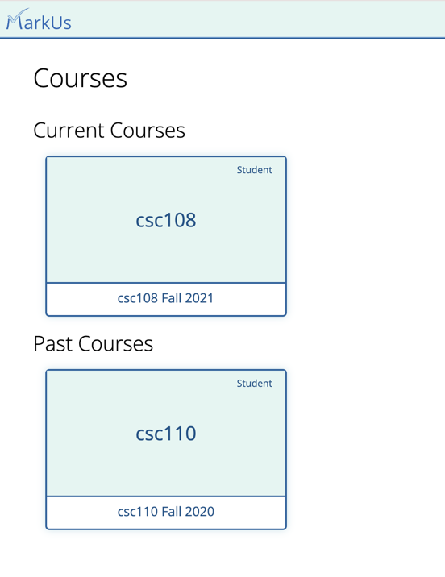
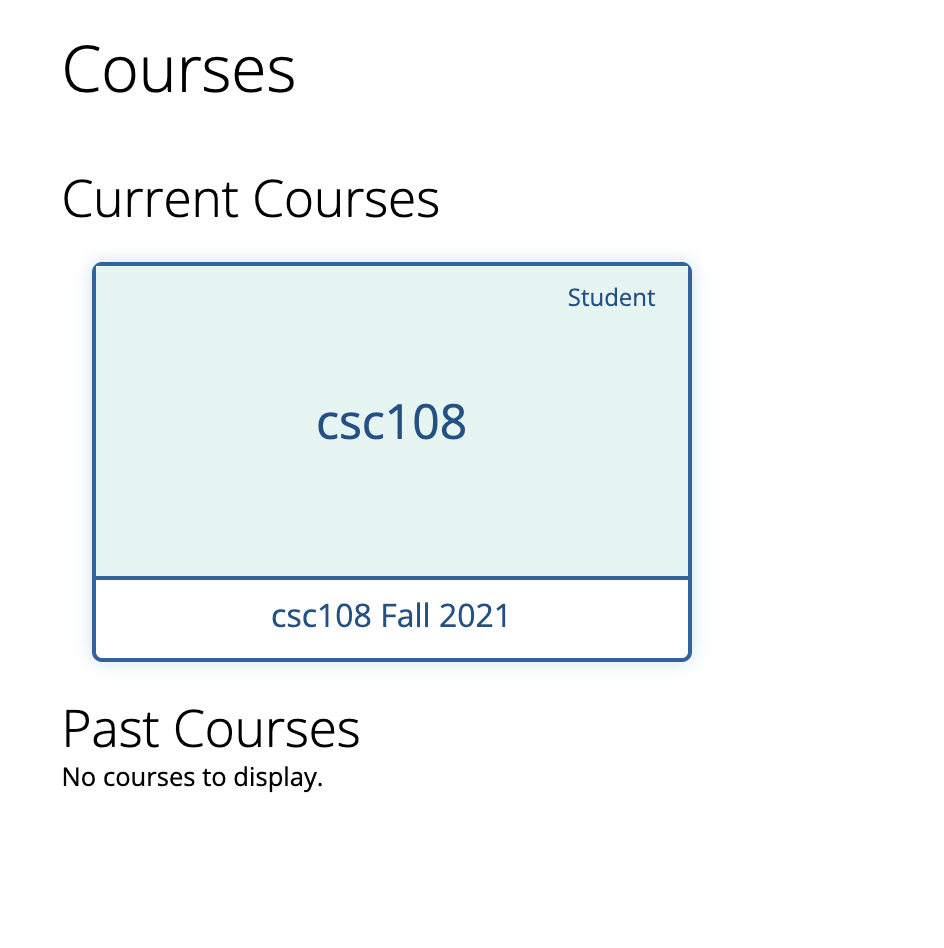

# Homepage

When you log in to MarkUs, the homepage displays your courses. Courses are grouped into two sections:

- **Current Courses**: courses whose end date has not passed.
- **Past Courses**: courses whose end date has passed.

If you do not have any courses in one of these groups, the message **No courses to display.** is shown.

