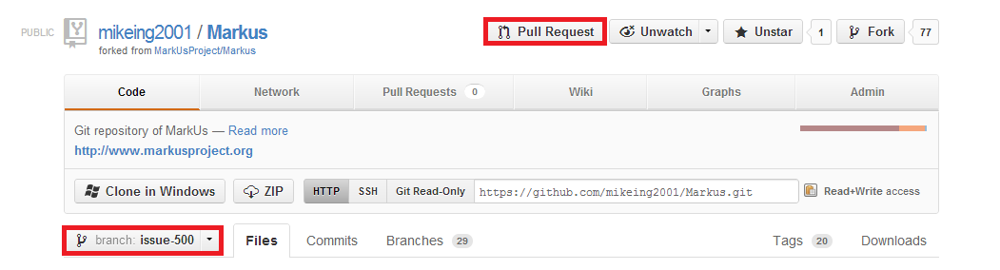

How to Do a Code Review
=======================

Every MarkUs developer has to perform a Code Review before their code can be merged (even for the smallest commit). This is a short guide as to how to use the Github Code Review system.

Creating New Review Requests
----------------------------

Once you have created a branch, worked on your code and committed your changes to your local git repository you are ready to create a review request.

1.  Go to the Github Web interface, find your fork, switch to the branch you have been working on and create a pull request (there should be a button for it).

2.  Enter an appropriate "Title".

3.  In the "Write" field, be sure to include the following:

    -   Issue number in the following format \#XXX
    -   Summary of the issue and your solution to the issue
    -   What testing was performed

### Reviewing Code of Your Peer-Developers

In general, after a review-request has been uploaded, there are 3 steps code, topic of a review-request, has to go through before it gets checked in into the MarkUs source code repository: 1. comment on review-request 2. revise review-request (if need be) and 3. check in changed source code (*provided* the review-request got a green light). Steps one and two need to be repeated as appropriate until the review-request gets an ok (or gets dropped without being committed at all).

But how to comment review-requests? The following steps outline how to do these things:

1.  Go to [https://github.com/MarkUsProject/Markus/pulls](https://github.com/MarkUsProject/Markus/pulls)/ and log in with your credentials.

2.  Once you have the desired review-request open, click on "Files Changed".

3.  Comment code by clicking the blue + on the on appropriate line numbers on the left. By pressing "Comment on this line", your review comments will be published immediately.

4.  If you think code is ready to be committed, give a message like "Good to Commit" or "Ready for Merge". A core MarkUs developer will merge the pull request.