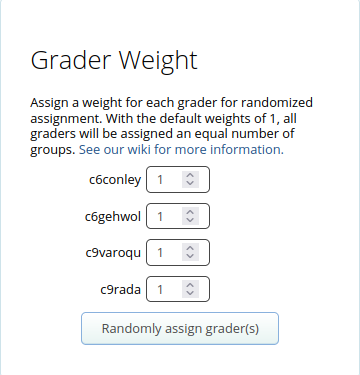

# Assigning Graders

## Table of Contents

- [Graders Tab](#graders-tab)
    - [Table Info](#table-info)
    - [Assigning](#assigning)

## Graders Tab

The graders tab can be used to assign graders to specific students. Once you assign a grader to a student, they will be able to perform all the same actions as the instructor account (including releasing marks). However, they may only perform these actions on students that have been assigned to them.

To assign a grader, navigate to the "Graders" tab by clicking on Assignments -> Graders:

### Table Info

When you arrive at the "Manage Graders" page you will see a table of graders:

- **User Name:** The username of the grader.
- **Name:** The full name of the grader.
- **Students:** The number of students currently assigned to that grader for this spreadsheet.

You will also see a table of students:

- **Section:** The lecture section the student is in.
- **User Name:** The username of the student.
- **Name:** The full name of the student.
- **Graders:** The user names of the graders currently assigned to that student.

### Assigning

There are three actions you may perform in terms of assigning/ unassigning:

**1.  Assign grader(s):** To perform this action you must select a grader from the grader table and at least one student from the student table by clicking on their check boxes. Then, click the "Assign grader(s)" button:

Once this is done, the name of the grader will appear in the "Graders" column of the students who they will be able to mark:

**2. Randomly assign grader(s):** This does the same thing as "Assign grader(s)" but it randomly assigns the graders (as opposed to you choosing who goes where). If multiple graders are selected the randomizer will assign the graders students as evenly as possible by default (e.g. 3 graders, 10 students, each graders will receive 3, 3, and 4 students respectively).

Upon clicking the button, a modal will pop up prompting you to assign weightings to each grader. Once this is submitted, the randomizer will assign graders so that they have as close to the ratio's specified as possible (i.e. 3 graders, 10 students, with weightings 1, 2, 0.33 should result in a grader with 3 students, a grader with 6 students, and a grader with 1 student).

**3. Unassign grader(s):**  This action will unassign graders that have already been assigned to students. To unassign a grader, you must select the student to which they are assigned, select the grader's row in the graders column and then click on the "Unassign grader(s)" button:

#### Assign to Criteria

Graders can also be assigned to mark individual criteria from the "Criteria" tab (not available for marks spreadsheets).

This will make sure that a grader can only edit the criteria they have been assigned. However, the grader will still be able to see all marks for the student unless the "Only show assigned criteria to graders" is selected as well.
