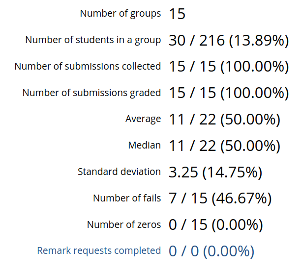

# Summary

## Table of Contents

- [Summary Tab](#summary-tab)
    - [Summary Table](#summary-table)
    - [Summary Statistics](#summary-statistics)

## Summary Tab

The summary tab can be used to view/visualize a variety of general statistics for a particular assignment. In addition, you may also view a summary of the grade breakdown for each submission. These are highlighted below.

### Summary Table

After visiting the summary tab, you will first see the summary table. This table gives a summarized grade breakdown for each student/submission. Each row in the table corresponds to a particular submission group. For each row you can view the name of the submission group, its marking state, any tags the submission may have, a total mark for the submission, and finally a mark breakdown of the submission from associated criteria.

If you wish to download this table for offline use in a CSV format, select the "Download" button in the top right. Alternatively, if you ran tests on submissions and wish to download the results of those tests, you can click the "Download Test Results" button also found in the top right.

### Summary Statistics

Clicking on the "Summary Statistics" tab in the top left corner of the summary page will take you to the summary statistics view. This view allows you to easily visualize and look at key statistics that summarizes overall student performance on the given assignment. This is an enlarged view of the summary statistics you can find on the dashboard.

#### Grades Distribution

In the top left section, you can see a chart that displays the distribution of grades for the given assignment.

To the right of the grade distribution chart is a set of statistics that give a brief overview of student performance on the given assignment. Statistics that are currently shown are:

- **Number of groups:** The number of groups created for this assignment. This is also the expected total number of submissions (assuming all groups have a submission).
- **Number of students in a group:** The number of students that are in a group out of all active students in the course.
- **Number of submissions collected:** The number of submissions that have been collected for marking out of the expected total number of submissions.
- **Number of submissions graded:** The number of submissions that have been collected and have recieved a mark out of the expected total number of submissions.
- **Average:** The average point grade of submissions for the given assignment (including submissions which recieved a zero) out of the maximum possible mark.
- **Median:** The median grade of submissions for the given assignment (including submissions which recieved a zero) out of the maximum possible mark.
- **Standard deviation:** The point grade standard deviation of submissions for the given assignment (including submissions which recieved a zero). In brackets next to this statistic is the standard deviation of submissions given as a percentage grade.
- **Number of fails:** How many graded submissions recieved a failing grade (i.e. recieved a grade under 50%) out of the expected total number of submissions.
- **Number of zeros:** How many graded submissions recieved a grade of zero out of the expected total number of submissions.
- **Remark requests completed:** How many remark requests have been completed out of the total number of remark requests recieved. This statistic will only show if you have enabled remark requests for the given assignment.

> :spiral_notepad: **Note:** In brackets, next to each of the statistics that are shown as a fraction, is the same statistic fraction but displayed as a percentage instead.

#### Criteria Distribution

Below the grade distribution chart, you can further analyze the distribution of grades using the criteria distribution graph. This graph shows the distribution of marks given for each associated criterion.

Each criterion corresponds to a colour shown in the labels just above the graph. By default, all grade data for criterions are hidden. In order to reveal the grade distribution for a specific criterion(s), simply click on the labels of all the criterion you wish to view and compare.

To help you get a quick overview of student performance for each criteria, next to the criteria distribution graph is a table that shows each criterion along with the average grade received for that criterion. Clicking on the drop down arrow next to each criterion will reveal additional summary statistics for that particular criterion.

The additional criterion statistics currently shown are:

- **Average:** The average point grade of submissions for the given criterion (including submissions which recieved a zero) out of the maximum possible mark for that criterion.
- **Median:** The median grade of submissions for the given criterion (including submissions which recieved a zero) out of the maximum possible mark for that criterion.
- **Standard deviation:** The point grade standard deviation of submissions for the given criterion (including submissions which recieved a zero). In brackets next to this statistic is the standard deviation of submissions for the given criterion as a percentage grade.
- **Number of zeros:** How many graded submissions recieved a grade of zero on this particular criterion out of the expected total number of submissions.

#### Grader Distribution

Finally, at the bottom of the view, below the criteria distribution chart, you can see another distribution of grades for an assignment. What differentiates this grade distribution chart from the normal chart at the top of the page however, is that this chart further breaks down the grade distribution graph in order to also show the distribution of marks given by each grader.

As with the criterion distribution, each grader corresponds to a colour shown in the labels just above the graph. Each label also shows how many submissions each grader has completed marking out of the number they were assigned.

To view a more discrete breakdown of each grader shown in the grader distribution graph, click on the "Graders" link in the bottom left corner of the grader distribution graph.

This will take you to a page that shows several individual graphs showing the distribution of marks given by each grader.

