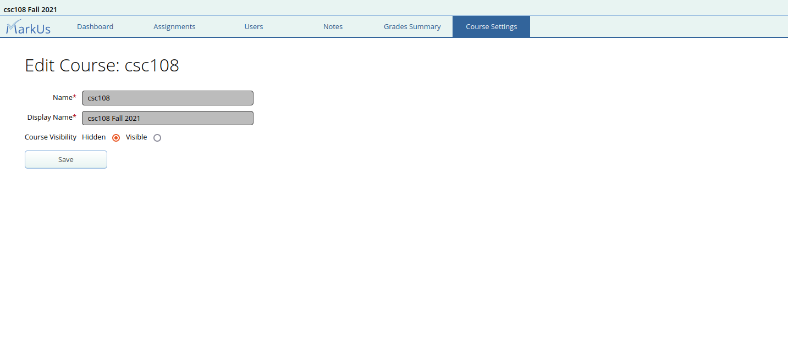

# Course Settings

The course settings page provides information on the name, display name and course visibility properties of a course.

- **Name**: The name or course code for this course.
- **Display Name**: A longer course name or title for users to see.
- **Course Visibility**: A toggle that determines whether students can see and access the course. Selecting "hidden" will prevent students from being able to view and access the course. To unhide a course from students, you may do so by setting the course as "visible". Graders and instructors for the course can still see and manage the course as usual.

> :spiral_notepad: **Note:** While you cannot change the name of a course, you are free to change its display name or toggle its visibility.
