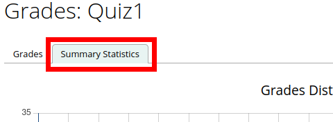
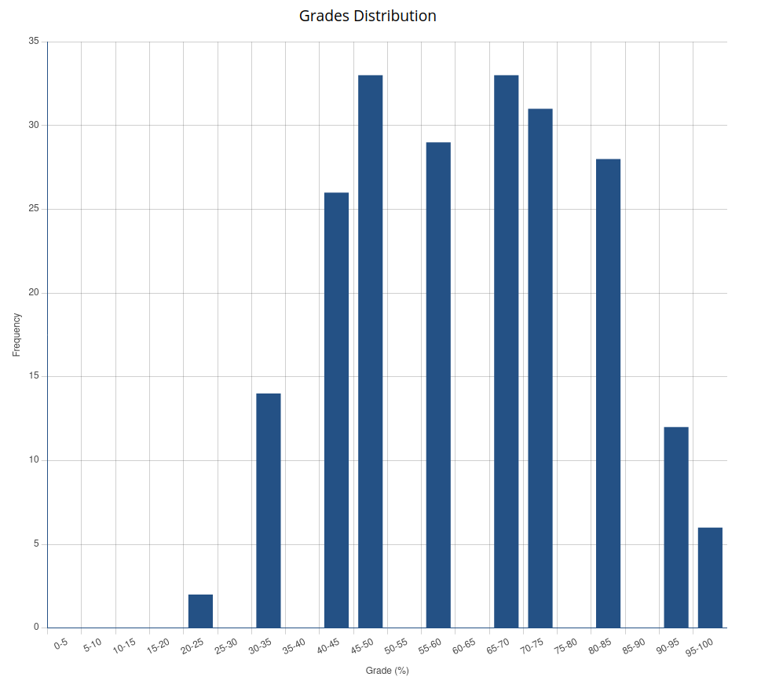
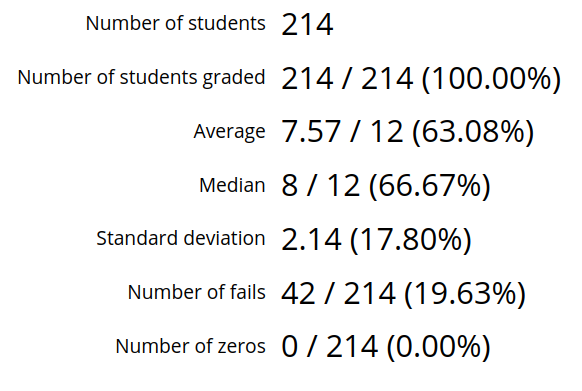
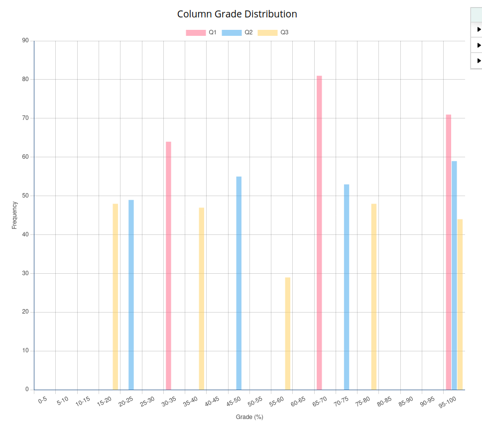
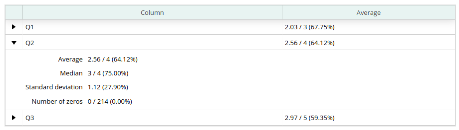

# Using a Marks Spreadsheet

## Table of Contents

- [Grades Tab](#grades-tab)
    - [Columns](#columns)
    - [Releasing Marks](#releasing-marks)
    - [Unreleasing Marks](#unreleasing-marks)
    - [Summary Statistics](#summary-statistics)
- [Graders Tab](#graders-tab)

> :spiral_notepad: **NOTE:** Make sure you have read the [set-up page](Instructor-Guide--Marks-Spreadsheets--Setting-Up.md) for marks spreadsheets before proceeding with this section.

## Grades Tab

In the grades tab you will be able to interact with your created spreadsheet. To navigate to to the "Grades" tab of your spreadsheet click on Assignments -> Grades:

The grades tab will automatically load all the active students in your course into the spreadsheet. If you wish to display inactive students as well, click on the "Display inactive students" checkbox at the top of the page.

### Columns

The marks spreadsheet contains a number of columns:

- **User Name:** Contains the username of the student (the name they use to log into MarkUs)
- **Section:** Contains the lecture section of the student. If no lecture section has been specified, then the field will be blank. Students may be placed into lecture sections from the "Users" page (See the "[Users](Instructor-Guide--Users.md)" page for more information).
- **First Name:** The first name of the student.
- **Last Name:** The last name of the student.
- **Column(s):** This is the main feature of the spreadsheet. You will now see the columns that you have created previously:

    - Each column will list its name (i.e. "Question 1") and the mark associated with the column (i.e. 12.0).
    - At the very end of your specified columns will be the "Total" column **if you checked the "Show total" checkbox in the [set-up](Instructor-Guide--Marks-Spreadsheets--Setting-Up.md) section**. The total column will have the sum of the **non-bonus mark columns** in parentheses.
    - The columns will all start empty and you may add in values for each student depending on their mark for each column. Negative values are not allowed however you may include values greater than what was specified for the column.
    - You may not modify the "Total" column.
    - The values in the table will save on their own and you do not have to press any special save button.
- **State:** Contains the release state of the spreadsheet. Possible values are "blank" if the student's marks have not been released yet or "Released" if they have.

### Releasing Marks

Once you create a spreadsheet, students will be able to see that there is a spreadsheet for their course but they will not be able to see their individual marks until you release them. To do this, click the checkbox of the rows of the students who's marks you'd like to release. You may select all the rows at once by clicking the top left checkbox and then click on the "Release Marks" button:

The "State" column should now say "Released" for all the marks that have been successfully released (you may need to refresh the page). Once this procedure is complete the students will be able to see their marks for each column and their total (if specified).

### Unreleasing Marks

Once a spreadsheet row has been released to a student, the student's column marks may not be changed. However, if you wish to modify their marks, you may unrelease their marks by selecting the rows again and clicking the "Unrelease Marks" button.

### Summary Statistics

Clicking on the "Summary Statistics" tab in the top left corner of the Grades page will take you to the summary statistics view.

Here, you can easily visualize and look at key statistics that summarizes overall student performance on the given marks spreadsheet. This is an enlarged view of the summary statistics you can find on the dashboard.

#### Grades Distribution

In the top left section, you can see a chart that displays the distribution of grades for the given marks spreadsheet.

To the right of the grade distribution chart is a set of statistics that give a brief overview of student performance on the given marks spreadsheet. Statistics that are currently shown are:

- **Number of students:** The number of students assigned to this marks spreadsheet.
- **Number of students graded:** The number of students that have at least one column mark.
- **Average:** The average total point grade for the given marks spreadsheet.
- **Median:** The median total grade for the given marks spreadsheet.
- **Standard deviation:** The total point grade standard deviation for the given marks spreadsheet. In brackets next to this statistic is the standard deviation given as a percentage.
- **Number of fails:** How many graded students recieved a failing total grade (i.e. recieved a grade under 50%) for the given marks spreadsheet.
- **Number of zeros:** How many graded students recieved a total grade of zero for the given marks spreadsheet.

> :spiral_notepad: **Note:** In brackets, next to each of the statistics that are shown as a fraction, is the same statistic fraction but displayed as a percentage instead. All marks shown include students that recieve a total grade of zero but does not include students who have a null total grade. Students which have a null grade for certain columns but have at least one valid column mark will have their null grade in the other columns be treated as a zero for the purposes of calculating their total grade

#### Column Grade Distribution

Below the grade distribution chart, you can further analyze the distribution of grades using the column grade distribution graph. This graph shows the distribution of marks given for each column.

Each column corresponds to a colour shown in the labels just above the graph.

To help you get a quick overview of student performance for each column, next to the column distribution graph is a table that shows each column along with the average grade received for that column. Clicking on the drop down arrow next to each column will reveal additional summary statistics for that particular column.

The additional column statistics currently shown are:

- **Average:** The average grade received for the given column.
- **Median:** The median grade received for the given column.
- **Standard deviation:** The point grade standard deviation for the given column. The percentage standard deviation for the given column is shown in brackets next to this statistic.
- **Number of zeros:** The number of submissions which recieved a grade of zero on the given column.

> :spiral_notepad: **Note:** All statistics include students that have recieved a valid grade for the given column. This includes students that received a mark of zero.

## Graders Tab

See [this page](Instructor-Guide--Assignments--Assigning-Graders.md) for instructions on how to assign graders.

## TODO

- [x] Insert Link to "users" page under "columns"
