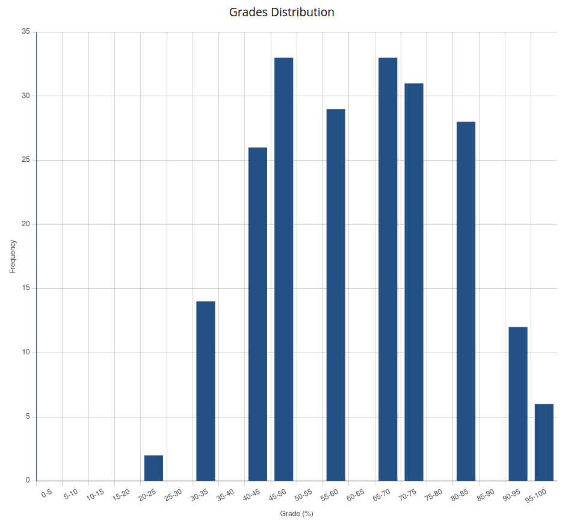
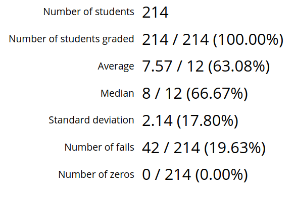

# Summary

## Summary Tab

The summary tab allows you to easily visualize and look at key statistics that summarizes overall student performance on the given grade entry form. This is an enlarged view of the summary statistics you can find on the dashboard.

### Grades Distribution

In the top left section, you can see a chart that displays the distribution of grades for the given grade entry form.

To the right of the grade distribution chart is a set of statistics that give a brief overview of student performance on the given grade entry form. Statistics that are currently shown are:

- **Date:** The due date for the grade entry form.
- **Number of entries:** The number of students that have at least one column mark out of all students assigned to the given given grade entry form.
- **Average:** The average point grade of submissions for the given grade entry form out of the maximum possible mark.
- **Median:** The median grade of submissions for the given grade entry form out of the maximum possible mark.
- **Standard deviation:** The point grade standard deviation of submissions for the given grade entry form. In brackets next to this statistic is the standard deviation of submissions given as a percentage grade.
- **Number of fails:** How many graded students recieved a failing grade (i.e. recieved a grade under 50%).
- **Number of zeros:** How many graded students recieved a grade of zero.

> :spiral_notepad: **Note:** In brackets, next to each of the statistics that are shown as a fraction, is the same statistic fraction but displayed as a percentage instead. All marks shown include students that recieve a zero but does not include students who have a null total grade.

### Column Distribution

At the bottom of the view, you can view an additional distribution of grades for the given grade entry form. This distribution however, is different from the Grades Distribution at the top of the page in that this distribution graph further breaks down the grades for the grade entry form by column.

Each column corresponds to a colour shown in the labels just above the graph