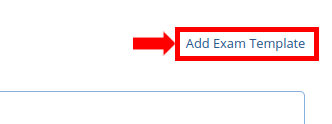
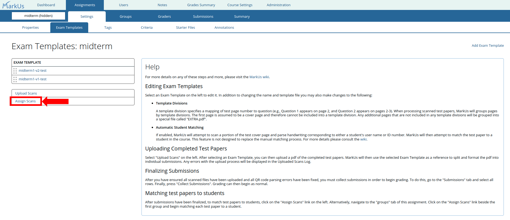

# Scanned Assignments/Exams

MarkUs scanned assignments allow instructors to administer in-person exams on paper and then upload these tests to MarkUs for grading.
This process involves five major steps:

1. Set up the scanned assignment on MarkUs and upload a blank copy of the test paper.
2. Generate exam papers with a unique identifier and QR code for each paper.
3. After giving the exam and collecting the student papers, scan them and upload them to MarkUs.
    To save time, MarkUs supports batch uploading of scanned pages, and splits them into individual papers using the QR codes.
4. Grade the scanned papers, using the [same process as regular assignments](Instructor-Guide--Assignments--Marking--Grading-View.md).
5. Associate each scanned paper with the correct student.

The rest of this page goes into detail for these steps.

## Creating a scanned assignment

To create a new scanned assignment:

1. Navigate to the "Assessments" page, and click on "Create Scanned Assignment".

    

2. When creating the new scanned assignment, the settings have the same meaning as [regular assignments](Instructor-Guide--Assignments--Setting-Up.md), except the assessment must be individual (so the group options are hidden), and students do not submit files to MarkUs (so the submission rule options are hidden).

    

    - You can set the "due date" field to after the test is complete, but we'll need to modify this field in the [Collecting and Grading] section below.

    When you are done with the settings, press "Save" to create the scanned assignment.

3. After creating the new assignment, navigate to the "Exam Templates" menu under the assignment settings.
    This is the page where you'll upload a copy of your test paper to MarkUs.

    

4. Click on "Add Exam Template". You can specify a name (e.g., "Midterm-1") and a PDF file containing your exam paper. Please see [Exam Format Requirements] below.

    

    

    - *Note*: names may only contain alphanumeric characters, hyphens, and underscores.

5. After the page refreshes, you should see the new exam template. You can modify the template name, download the exam paper file to view it, and replace it if you make changes to the paper.

    

    - *Note*: To save your changes click on the "Save" button underneath the Template Divisions section

MarkUs supports a scanned assignment with more than one test version (for example, if your course has multiple sections, and different test versions for each section).
You may repeat steps 3-4 to create different exam templates for each test version.
*Note*: Every exam template must have a unique name.

### Exam format requirements

MarkUs has the following requirements for exam papers used as exam templates:

1. The exam paper must be uploaded as a PDF file.
2. The paper must have a *top margin of 2 inches*. This space is required for a QR code.

    <!-- - *Tip*: You accommodate this larger top margin, you can choose to design your test using legal paper size instead of letter/A4 paper size. -->

3. The paper's *first page* must contain space for students to include their name or other identifying information.

    - Other pages may or may not include identifying student information.

### Automatic matching of student papers

MarkUs supports automatic matching of student papers based on student user names or ID numbers written on the cover page of a test.
If this feature is enabled, MarkUs will attempt to scan a portion of the test cover page and parse handwritten corresponding to either a student's user name or ID number attempt to match the test paper to a student in the course.

*Note*: this feature is meant to assist, but not replace, the manual matching process described below. MarkUs may be unable to correctly parse this information from the test cover page, or it may be written incorrectly and not match any students.

Automatic matching is configured separately for each exam template.
To enable and use the automatic matching feature for an exam template:

1. Go to the Settings -> Exam Templates tab, and find the exam template.
    - Ensure that your exam template has a *rectangular grid* for where students should enter their user name or id number (see our [sample file](https://github.com/MarkUsProject/Markus/blob/master/db/data/scanned_exams/midterm1-v2-test.pdf) for an example).

2. Under the "Automatic Student Matching" field, select the "Automatically match students to uploaded scanned exams" option.

    

3. MarkUs will display the cover page of the exam template and a drop-down menu.

    a. On the cover page, click-and-drag to select the region of the page where the students will write their user name/id number. We recommend including a small margin to account for positional adjustments when you scan the test papers.

    

    b. On the drop down, select whether to match the information on the students' user name or id number. You must choose one or the other; MarkUs does not support matching on both.

    

4. Press Save. You will be able to update these settings any time before scanning and uploading your test papers.

    

5. Then after giving the test, follow the instructions under "Uploading completed test papers" below. As part of that process, MarkUs will automatically parse and handwriting in the selected region, and attempt to match it against the selected student field (user name or id number). You can view the results of this matching under the "Groups" tab, and match the remaining test papers to students by following the instructions under "Matching test papers to students" below.

    **Note**: MarkUs takes a conservative approach, and will only match students if there is an exact match on the handwritten field.

#### Known limitations

1. MarkUs requires a rectangular grid for where students write their user name/id number.
2. MarkUs requires the student information to be written on the first page of the test paper. Other positions (e.g., the last page) are currently not supported.

## Generating exam papers

To administer the exam, you'll need to generate a unique test paper for each student.
You can do so in MarkUs by following these steps:

1. Navigate to the "Exam Templates" page of the scanned assessment.
2. Select the Exam Template with which you wish to generate test papers for.
3. In the top right corner of the selected Exam Template's properties find the "Generate Exam Copies" button.

    

4. Fill in the two fields in the modal:

    

    - Number of copies: the number of test copies to generate.
    - Start index: the starting number for the first test copy. This index increases by 1 for each test copy.

    For example, if "Number of copies" is 10 and "Start index" is 1, you'll generate ten test copies, numbered 1 through 10.
5. Press the "Generate" button. MarkUs will generate a PDF file for you to download, containing the generated test copies.

    - Each generated test copy has a QR code at the top of the page, with a text code beside it in the form `<template name>-<copy number>-<page number>`.
    - It is safe to generate the same file and even the same copy number more than once. However, you should be careful to not give the same test copy to more than one student!

*Note*: if "number of copies" is more than 1, the downloaded file will contain multiple copies of the test paper.
If you intend to have your printer staple each paper, you will need to configure your printer to split the PDF, or split the PDF manually into individual paper files before sending them for printing.

## Uploading completed test papers

After your test is complete, you should scan all test papers (saving the scans as PDF files) and prepare to upload them to MarkUs.

1. **Before** uploading any scanned files to MarkUs, you need to configure *template divisions* for each exam template you specified.
    A template division specifies a mapping of test page number to question (e.g., Question 1 appears on page 2, and Question 2 appears on pages 2-3).
    When processing scanned test papers, MarkUs will groups pages by template divisions to make it easier to grade the same question across all submissions.

    

    Notes on template divisions:

    - The first page is assumed to be a cover page that will be grouped into a special file called "COVER.pdf". It therefore, cannot be grouped into a template division.
    - The "Start" and "End" fields are both inclusive.
      So if a question appears on a single page, use that page number for both the "Start" and "End".
    - If a page contains more than one question, you should specify one template division for both questions (e.g., with a label "Q1-Q2").
    - Any pages (besides the first) that are not included in any template divisions will be grouped into a special file called "EXTRA.pdf". This is useful if you provide additional pages for students to use during the test.
    - You can also put all pages (not including the first page) into a single template division. Such a template division should go from page 2 until the last page number in the test.

2. After configuring the template divisions, you are ready to upload the scanned test papers.
    To do so:

    a. Navigate to the "Upload Scans" section of the Exam Template page.

    

    b. Select which exam template you want MarkUs to use when processing the pdf.

    

    c. Select the pdf file containing the scanned test papers you wish to upload.

    

    d. Press "Upload". MarkUs will then process the uploaded file, scanning QR codes and grouping pages by their exam number and by template division.

    

    The Exam Templates page will then be refreshed and the "Uploaded Scans Log" table at the bottom of the "Upload Scans" section will be updated.
    These logs provide a record of all uploaded files for the scanned assignment.

    

3. MarkUs may be unable to parse some QR codes. Pages where there was an error in parsing will appear under "Pending errors", and you can view each page by expanding the row in the "Uploaded Scans Log" table.

    Because MarkUs prints the copy number and page number beside the QR code, instructors can manually fix parsing errors. To do so:

    a. Click on the "Fix" link beside an error page.

    

    b. You'll be taken to a new screen where you can see the scanned page and text label, and input the copy number and page number. (The text label is in the form `<template name>-<copy number>-<page number>`.)
        You can also specify if the page was scanned upside down, so that MarkUs will reorient the page when displaying it for graders.

    

    c. Press "Save". You'll be automatically taken to the next error page, where you can repeat this process until all errors have been fixed.

### Finalizing submissions

When you are done uploading all scanned files and fixing all QR code parsing errors, you are ready to finalize the scanned files for grading.
This is done by *collecting* the submissions:

1. Go to the "Submissions" tab and select all rows.
2. Press the "Collect Submissions" button (do this only *after* you are sure you've scanned all test papers and fixed all parsing errors).

    

This will allow grading to begin, and for instructors to match each test paper with the corresponding student.

*Note*: Unlike timed or normal assignments, collecting submissions for scanned exams ignores due dates. This means that when collecting submissions for scanned exams, by default the latest submission will always be collected even if it is submitted past the due date for the scanned exam. If you wish to override this behaviour, you can still [manually override the default collection process](Instructor-Guide--Assignments--Marking--Set-Up.md#overriding-the-default-collection-process).

## Grading the scanned assignments

After the scanned test papers have been collected, you can assign graders and [grade submissions just like regular assignments](Instructor-Guide--Assignments--Marking--Grading-View.md).

**Note**: grading can begin even if students aren't yet matched to test papers.

## Matching test papers to students

Matching test papers to students is done manually by instructors, after submissions have been collected.

1. Navigate to the "Assign Scans" section of the Exam Template page. This will take you to the first scanned exam without an associated student. Alternatively, you can also navigate to the "Groups" tab for the assignment and clicking on the "Assign Scans" link beside the first group.

    

2. You'll be taken to a new page that displays the first page for the group. Type in the student's identifying information and press "Save" to match the paper to the student.

    

    - *Tip*: MarkUs supports search by student name, user name, or student number.
    - *Tip*: If the student does not appear in the autofill, you can also enter the student's full name into this field before saving. Note that this must be their first and last names as listed in the students table.
3. You'll be automatically taken to the next unmatched group. Repeat this process until all groups are matched.
