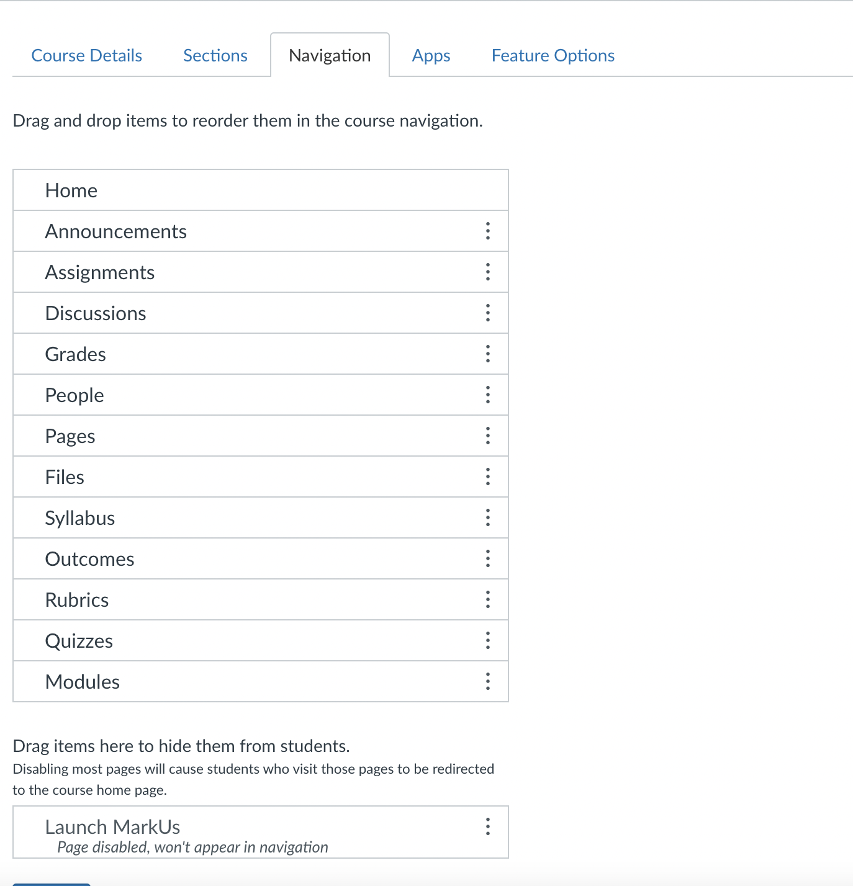
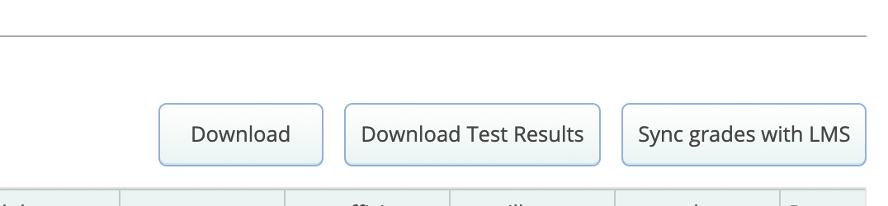

# Learning Tools Interoperability (LTI)

MarkUs integrates with other Learning Management Systems (LMS) via the LTI standard.
Currently MarkUs supports the following LMS platforms:

- Canvas

## For LMS Administrators

### Installing MarkUs on an LMS

Each LMS implements their own LTI integration process.
Typically, only administrators can add LTI integrations.

### Canvas

To add MarkUs to a Canvas instance, see their page on
[configuring LTI keys](https://community.canvaslms.com/t5/Admin-Guide/How-do-I-configure-an-LTI-key-for-an-account/ta-p/140).

MarkUs can be added via a configuration URL. The configuration URL is available at  /lti_deployments/get_canvas_config

## For Instructors

## LTI settings

After connecting a MarkUs course with an LMS course (see below for platform specific instructions),
the associations can be viewed on the course settings page. On this page you can manually trigger a roster synchronization,
and also choose to delete an association between the LMS and MarkUs.

> **NOTE:**
> Destroying an LTI association will also destroy any LTI assignment settings on MarkUs.
> However, it will *not* destroy any data that has been sent from MarkUs to the LMS.
> If an association is reestablished, any assignment's LTI settings must be re-created,
> and will create *new* LMS gradebook items.

### Canvas

Once installed in your course, a 'Launch Markus' page will appear in your
course's navigation (disabled by default), and needs to be added to the navigation:

If you believe MarkUs should be installed in your course but it does not appear,
contact your canvas admistrators.

> **NOTE:**
> The additional navigation item will only be visible to instructors and
> administrators (not students)

#### Associating your Canvas Course with your MarkUs course

Once MarkUs is configured with Canvas, an association between your
Canvas course and your MarkUs course must be made.
Click 'Launch MarkUs' in your Canvas course. If you are not logged in to MarkUs,
you will be prompted to do so. Once you are logged in, you will be presented with
a list of MarkUs courses to choose from. Select the course that matches your Canvas
course and submit the form. If your course does not appear in the list,
you may click 'create new course', which will create a new
course based on the Canvas course information with you as an instructor.

#### Creating a Grade Book entry for a MarkUs Assignment

Once a course association has been established, each assignment will
have an option to create an associated entry in the Canvas course. This will allow grades from a MarkUs assignment
to be sent to the associated LMS once grading is complete.
On the assignment's LTI Settings page, simply check the box for each
Canvas instance where a gradebook item should be created, and click the save button.

#### Sending grades from MarkUs to the LMS

If an assignment has an LMS grade book entry, the assignment
summary page will have a 'Sync Grades to LMS' button.

Clicking on this button will open a modal with a checkbox for each
associated LMS course. Check the box for each Canvas course the grades should be synced to.

>**Note**: Only grades in the *released* state will be synced.

#### Syncing Canvas course roster with MarkUs

MarkUs will automatically attempt to sync course rosters with Canvas when grades are sent to Canvas.
Any students in the Canvas course that are not present on MarkUs will be created.
A roster sync can also be triggered manually on the course settings page.
