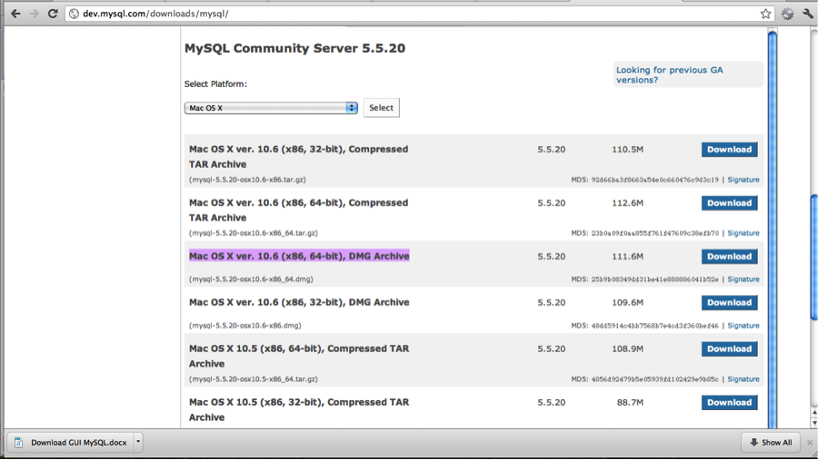
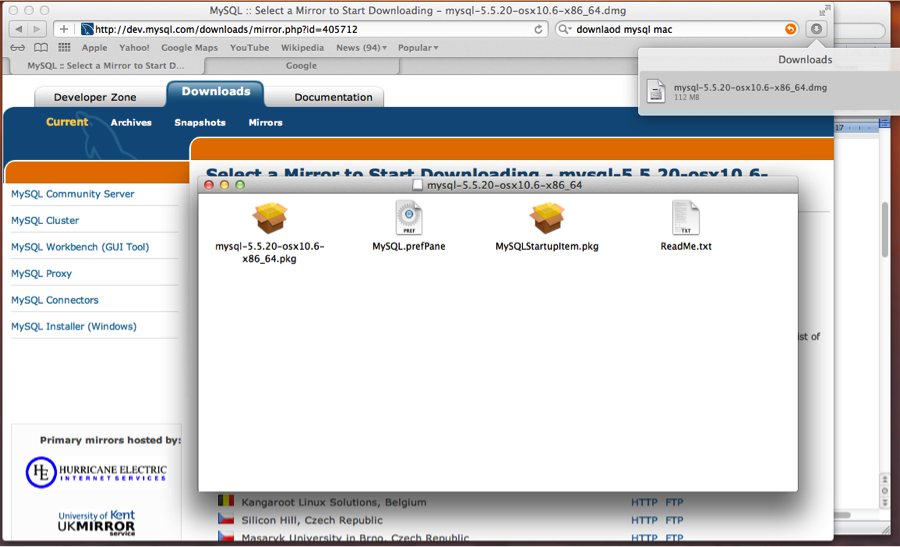
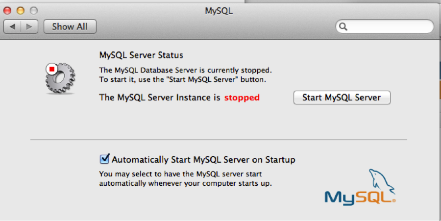

================================================================================
Setting up the Database (MySQL)
================================================================================

Installing the Database
================================================================================

GNU/Linux
--------------------------------------------------------------------------------

On Debian and Ubuntu, a simple ::

   apt-get install mysql libmysqlclient-dev

Mac OS X - MySQL Installer
--------------------------------------------------------------------------------

To install MySQL, you can use the installer from this site: [[MySQL Downloads |
http://dev.mysql.com/downloads/mysql/]] 

Select the MySQL for your OS. I have Mac Snow Leopard, so I selected Mac OS X ver. 10.6 (x86, 64-bit), DMG. 
Please select the dmg file.

In order to use the software you would have to register as a new user. 

The downloading should start and the file will be saved in your “Downloads” folder. Double click on the Dmg file to start the installation. 

You will get a new window as shown below:-

Run the “mysql-5.5.20-osx10.6-x86_64.pkg” first
Then run the MySQlStartupitem.pkg
Then run the MySQL.prefPane

A window like this should be displayed

.. figure:: images/Installation_MySQL3.png
   :scale: 100%
   :align: center
   :alt: Git

Install it depending on your preference.

After the installation is completed, a window like this should be displayed. 

Click on Start MySQL Server, to start the server.

Mac OS X - MySQL 5 MacPorts Installation
--------------------------------------------------------------------------------

You can also install MySQL using MacPorts instead by following the instructions on this
site: [[MySQL 5 MacPorts installation |
http://www.freerobby.com/2009/09/01/installing-mysql-via-macports-on-snow-leopard-for-ruby-development/]]

After the installation is complete, you'll need to update your
`PATH` environment variable. If you installed MySQL via the
installer, add `/usr/local/mysql/bin` to your `PATH`. If
you installed MySQL via MacPorts, add `/opt/local/lib/mysql5/bin`
to your `PATH`. 

Microsoft Windows
--------------------------------------------------------------------------------

Configuring MySQL
================================================================================

Creating a database user
--------------------------------------------------------------------------------

To create a database user, enter the following commands: (In this example, the
user is named 'markus', his password is 'markus', and he will be given
superuser privileges. This user will be used for MarkUs later on.)::

    #>mysql --user=root --password=<my password> mysql
    #>CREATE USER 'markus'@'localhost' IDENTIFIED BY 'markus';
    #>GRANT ALL PRIVILEGES ON *.* TO 'markus'@'localhost' WITH GRANT OPTION;

You can now try connecting to the server using the user you just created::

    #>mysql --user=markus --password=markus

You should see the MySQL console.

Configuring MarkUs
--------------------------------------------------------------------------------

Setup the database.yml file, in the MarkUs' root directory:

* `cp config/database.yml.mysql config/database.yml`

* change the usernames and password to the ones you used in the section above

* uncomment the development and test sections of config/database.yml

Now go back to the MarkUs tutorial :

* Installation on GNU/Linux

  * [[Development environment|InstallationGnuLinux]]
  * [[Production environment|InstallProdStable]]
  * [[Old Stable (deprecated) environment|InstallProdOld]]

* Installation on Mac OS X

  * [[Development environment|InstallationMacOsX]]
  * Production (need to be done)

* Installation on Windows

  * [[Development environment|InstallationWindows]]
