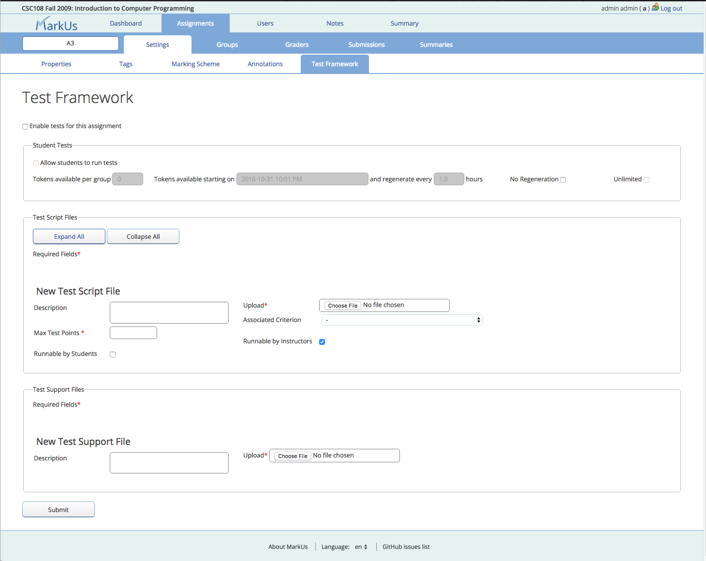
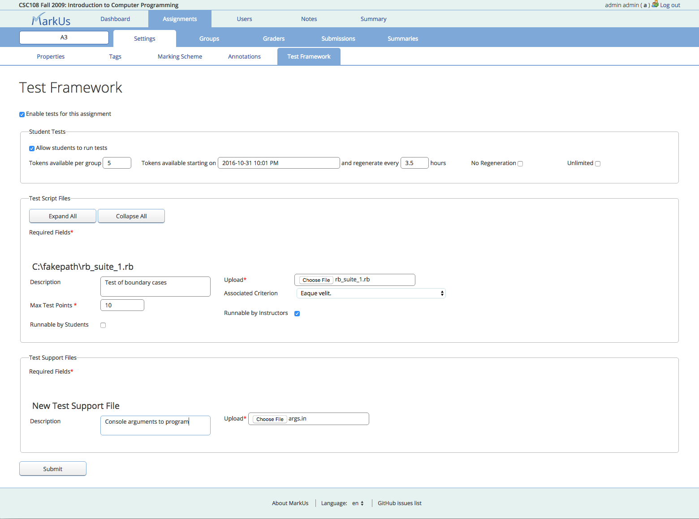

Test Framework
==============

Definition
----------

The Test Framework is a system allowing the automatic testing of students' code from inside the MarkUs web portal. The tests themselves are not run within MarkUs; instead the Framework serves as an intermediary between users and existing testing systems.

How does it work ?
------------------

Check these blog articles :

-   [http://blog.markusproject.org/?p=1561](http://blog.markusproject.org/?p=1561)
-   [http://blog.markusproject.org/?p=1634](http://blog.markusproject.org/?p=1634)
-   [http://blog.markusproject.org/?p=2198](http://blog.markusproject.org/?p=2198)

Can I use it ?
--------------

The Test Framework is still in alpha. Use it at your own risk!

How can I use it ?
------------------

The Test Framework is under active development and is not yet in the stable release of MarkUs. You will have to use the master branch of the code on GitHub to be able to test it.

### As a SysAdmin of MarkUs instance

You will need **Ant**. Install *ant* and *ant-contrib* packages on Debian/Ubuntu distributions.

In particular, if you have errors about a *for task not found*, it is because Ant has difficulties with ant-contrib. This could be a result of not using a high enough version.

### As an Administrator

The administrator can determine whether each test is runnable by graders and/or students. Administrators are able to run all tests by default.

In order to avoid overloading the testing system during periods of high demand, student access to the test framework is controlled using test tokens. A student or group can run tests as many times as they have tokens. On the test framework configuration page, the administrator can decide how many tokens to allocate to each student/group (or provide unlimited tokens), determine whether tokens regenerate and how often, and decide when students can begin running tests by setting a start time for token availability.

### As a Grader

A Grader can run tests as many times as they want. Results will show up on the grading page. If tests don't run properly, graders have access to the test logs to determine problems, but do not have the ability to correct **Ant** files.

Graders will have to report to the Admin if tests do not run.

### As a Student

As mentioned above, the Student is assigned tokens for running tests. Tokens regenerate every hour by default, though this is easily adjustable by the administrator. If a group or student has remaining tokens, they do not carry over to the new period.

Writting a build.xml
--------------------

You can find some useful ressources here : [http://www.markusproject.org/dev/ant\_files.zip](http://www.markusproject.org/dev/ant_files.zip)

Ant uses a file called build.xml to construct the project. It is this file that will describe all tasks that Ant will run when running tests.

There is also a file called build.properties where we put some variable definitions.

MarkUs will create a folder where it will put students' files :

    automated_tests/group_0001/A1/
                               |
                               |-build/
                               |
                               |-lib/
                               |
                               |-parse/
                               |
                               |-reports/
                               |
                               |-src/
                               |
                               |-test/
                               |
                               |-api.txt
                               |
                               |-api_helper.py
                               |
                               |-api_helper.rb
                               |
                               |-build.properties
                               |
                               |-build.xml

MarkUs will put student's files in src. MarkUs will put test files given by the Administrator in test. It will also pul librairies given by the Administrator in lib.

api\_helper.py and api\_helper.rb are two identical scripts used by Ant to return test results to MarkUs. api.txt contains the user api key. It allows api\_helper to communicate with MarkUs.

### Java

#### build.xml

#### build.properties

    #build.properties
    #Here you can add some properties for your project

    src.dir = src
    build.dir = build
    test.dir = test

    reports.dir = reports

    api_key.file = api.txt

Usage of the API Key
--------------------
